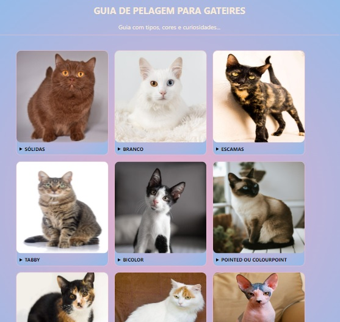

# Guia-de-Pelagem-de-gatos
Projeto feito no Curso Online Eu ProgrAmo | FE2 | Turma 03 da Programaria
<h1 align="center">
  
</h1>

<h2 align="center"> 
Foi abordado 8 módulos no curso com os seguintes temas:</h2>

 🛩️ Todos à bordo!   
👩‍💻  Esquentando os motores!      
 🩻 Apresentando novas tags HTML!    
🎨  CSS e layouts responsivos!    
🧠  Aprofundando os conhecimentos em JavaScript!   
🗃️ Dinamizando o código com Javascript!   
🚀 Decolando o seu projeto  
💡 Inspire-se nessas astronautas!
 
 
 ### Linguagens Ultilizadas: 
 
 [HTML](https://developer.mozilla.org/pt-BR/docs/Web/HTML)    
 [CSS](https://developer.mozilla.org/pt-BR/docs/Web/CSS)   
 [JavaScript](https://developer.mozilla.org/pt-BR/docs/Web/JavaScript)  
 
 ### Ferramenta:
 [Visual Studio Code](https://code.visualstudio.com/)    
 
 ### Projeto Original:
 
  [GitHub](https://euprogramo.github.io/dicionario-mulheresnegras//)

- Dando seguimento ao curso e com base no projeto final, finalizei com a seguinte proposta:           

*Como boa gateira, resolvi fazer um gui de pelagens de gatos. Espero que gostem ahaha*!

<h2 align="center">Ilustração do Projeto</h2>

<h3 align="center">
  Pages: https://mizarocha.github.io/Diario/</h3>

<h3 align="center"> Autora: Helida Rocha </h3>   

   
  
  

<h4 align="center">Desenvolvido com 💜 </h4>
